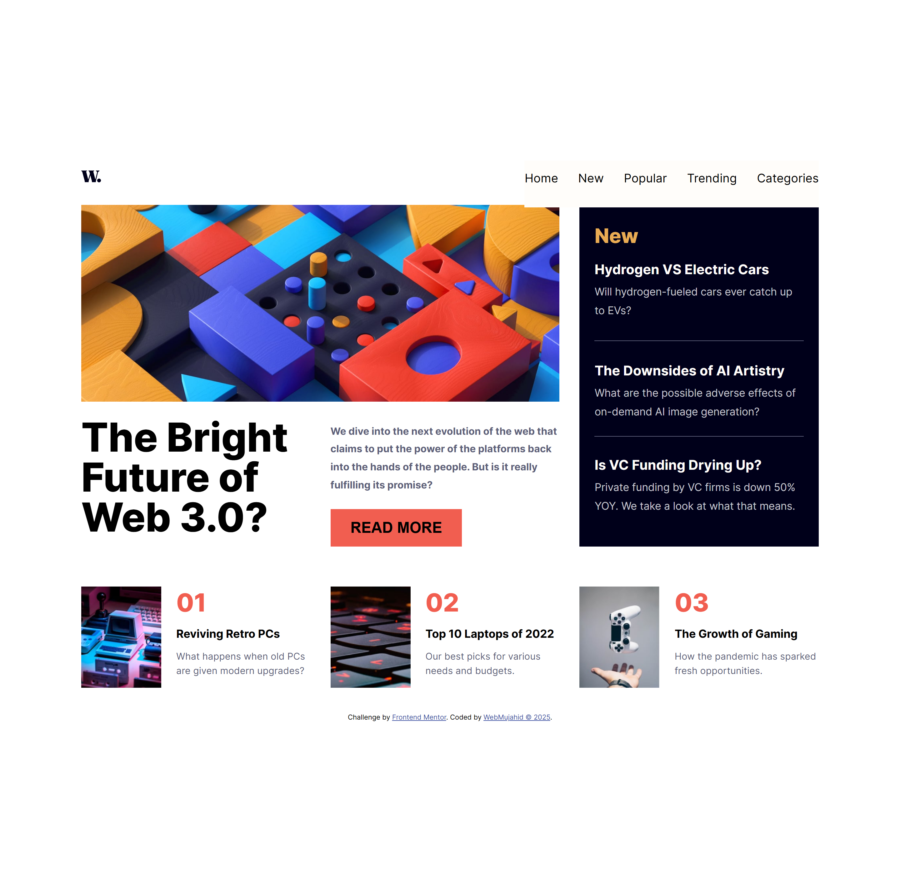
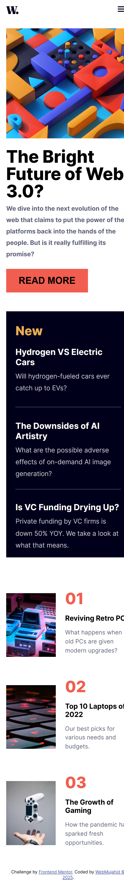

# Frontend Mentor - News Homepage Solution

This is a solution to the [News homepage challenge on Frontend Mentor](https://www.frontendmentor.io/challenges/news-homepage-H6SWTa1MFl).

## Table of contents

- [Overview](#overview)
  - [Screenshot](#screenshot)
  - [Links](#links)
- [My process](#my-process)
  - [Built with](#built-with)
  - [What I learned](#what-i-learned)
  - [Continued development](#continued-development)
  - [Useful resources](#useful-resources)
- [Author](#author)

## Overview

### Screenshot

  


> Add your screenshots above. You can capture from your deployed site and place them in the project root.

### Links

- Solution URL: [GitHub Repository](https://github.com/Abdulgafar-Riro/Challenge--15)
- Live Site URL: [Netlify Deployment](https://webmujahid-news-page.netlify.app)

## My process

### Built with

- Semantic HTML5 markup
- CSS custom properties
- Flexbox
- CSS Grid
- Mobile-first workflow
- [React](https://react.dev/)
- [Vite](https://vitejs.dev/)
- [Tailwind CSS](https://tailwindcss.com/)

### What I learned

Working on this project gave me more hands-on practice with the `<picture>` element for responsive images and handling asset paths in React when deploying to Netlify.

For example:

```jsx
<picture>
  <source
    media="(min-width: 1200px)"
    srcSet="/assets/images/image-web-3-desktop.jpg"
  />
  <source
    media="(max-width: 1200px)"
    srcSet="/assets/images/image-web-3-mobile.jpg"
  />
  
</picture>
```

I also learned the importance of using **absolute paths or `public/` folder assets** in React projects, since relative paths like `../../src/...` may break after deployment.

### Continued development

- Improve accessibility (ARIA attributes, alt text)
- Explore using modern image formats (WebP, AVIF) for optimization
- Add animations and transitions for enhanced user interaction
- Improve reusable component structure in React

### Useful resources

- [MDN Docs on `<picture>`](https://developer.mozilla.org/en-US/docs/Web/HTML/Element/picture) – Helpful for responsive images.
- [React Documentation](https://react.dev/) – Essential for understanding asset handling in React projects.
- [Netlify Docs](https://docs.netlify.com/) – For deployment guidance and troubleshooting.

## Author

- Frontend Mentor – [@Abdulgafar-Riro](https://www.frontendmentor.io/profile/Abdulgafar-Riro)
- GitHub – [@Abdulgafar-Riro](https://github.com/Abdulgafar-Riro)
